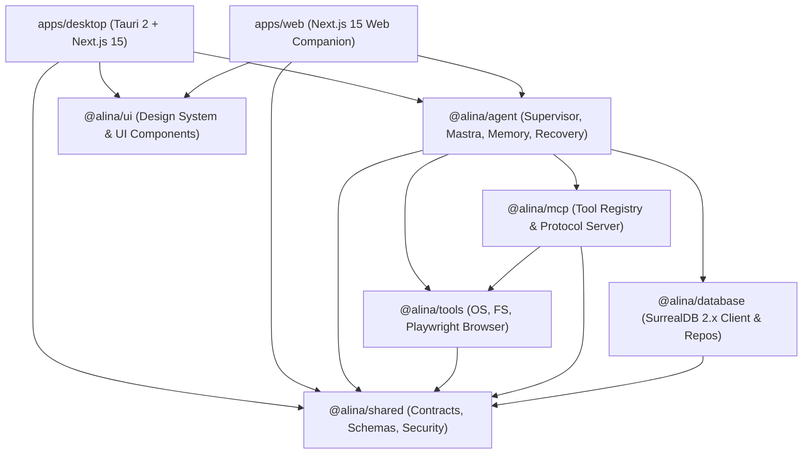

# ALINA Engineering Directives & Architecture Skill

This skill governs all engineering activities within the **ALINA (Autonomous Language Intelligence & Navigation Assistant)** codebase. Every autonomous agent, coding assistant, and contributor operating on ALINA must adhere strictly to these conventions.

---

## 1. Prime Invariants for Autonomous & Human Engineering

1. **Inspect Before Modifying**:
   Always read existing implementations, contracts, and tests before making changes. Never rewrite working architecture unnecessarily or replace modular patterns with monolithic shortcuts.
2. **Zero Destructive Operations Without Human Approval**:
   Mutating file operations outside scratch, arbitrary shell execution, system configuration edits, process launches, and sensitive web interactions must trigger the `HitlCoordinator` and await explicit user approval.
3. **Never Bypass Security Controls**:
   Under no circumstances should `PathJail`, `CommandInspector`, Tauri authorization grant tokens, or sandbox validations be disabled or mocked in production code paths.
4. **Canonical Shared Contracts First**:
   All domain entities, tool parameters, IPC schemas, and event payloads must be defined in `@alina/shared` using Zod schemas with TypeScript inference (`z.infer<typeof ...>`).
5. **No Blind Side-Effect Retries (Idempotency Guard)**:
   Before retrying potentially side-effecting operations (file writes, process execution), verify whether the destination or environment already matches the expected state.
6. **Mandatory Verification Before Completion**:
   Every agent must run and verify typechecking, linting, unit tests, and desktop compilation before declaring a task complete.

---

## 2. System Architecture & Tech Stack



- **Monorepo Engine**: pnpm workspaces + Turborepo (`turbo.json`).
- **Desktop Shell**: Tauri 2.0 (Rust native bridge in `apps/desktop/src-tauri`).
- **Presentation**: Next.js 15 (App Router), React 19 / 18, Vanilla CSS & Tailwind CSS tokens, Lucide icons.
- **Agent Orchestration**: `@alina/agent` powered by Mastra model abstraction, `SupervisorAgent`, `TaskRecoveryEngine`, and `TaskWatchdog`.
- **Tool Sandbox & Execution**: `@alina/tools` (sandboxed OS commands, filesystem access, Playwright browser automation).
- **Protocol & Extensibility**: `@alina/mcp` (Model Context Protocol server/client with dynamic approval elicitation).
- **Data & Vector Storage**: `@alina/database` (SurrealDB 2.x multi-model database, graph relations, vector search, atomic transactions, and in-memory offline fallback).
- **Shared Kernel**: `@alina/shared` (Zod schemas, `PathJail`, `CommandInspector`, canonical task states, risk models).

---

## 3. Package Boundaries & Responsibilities

| Package / App | Path | Allowed Responsibilities | Forbidden Patterns |
|:---|:---|:---|:---|
| `apps/desktop` | `apps/desktop/` | UI components, visual pages, invoking IPC / agent hooks, Tauri commands. | **No** direct OS manipulation, raw database queries, or heavy agent planning logic. |
| `apps/web` | `apps/web/` | Web companion interface, dashboard, lightweight inspection views. | **No** privileged desktop system calls or uncontained file execution. |
| `@alina/shared` | `packages/shared/` | Zod schemas, canonical types, path sandboxing (`PathJail`), command parsing (`CommandInspector`), risk models. | **No** heavyweight runtime dependencies (Playwright, SurrealDB client, Mastra). |
| `@alina/agent` | `packages/agent/` | Supervisor agent, sub-agent planning, model adapters, memory, crash recovery, watchdog. | **No** DOM manipulation or direct desktop window management. |
| `@alina/tools` | `packages/tools/` | Sandboxed tool implementations (filesystem, OS process, browser navigation). | **No** bypassing `PathJail` or executing without `ToolExecutionContext`. |
| `@alina/mcp` | `packages/mcp/` | Model Context Protocol servers, tool registration, operator approval callbacks. | **No** executing `REQUIRES_APPROVAL` tools without eliciting consent. |
| `@alina/database` | `packages/database/` | SurrealDB connection management, schema migrations, typed entity repositories, checkpoints. | **No** non-atomic multi-record mutations without transaction blocks. |
| `@alina/ui` | `packages/ui/` | Shared design tokens, buttons, inputs, modals, layouts. | **No** backend service calls or business domain state logic. |

---

## 4. Coding Conventions & Standards

- **Strict TypeScript**: Every package enforces `"strict": true`, `noImplicitAny`, `strictNullChecks`, `noUnusedLocals`, and `noUnusedParameters`.
- **Zero Arbitrary `any`**: Strictly prohibited. Use typed generics, `unknown` with Zod parsing, or strong domain interfaces.
- **Error Handling**: Throw typed, actionable errors. Never silently swallow rejections. When SurrealDB or external services are unreachable, cleanly degrade to offline in-memory fallback and log actionable warnings.
- **Canonical State Machine**: Tasks must use the 11 uppercase canonical states:
  `CREATED`, `PLANNING`, `READY`, `RUNNING`, `WAITING_FOR_APPROVAL`, `WAITING_FOR_NETWORK`, `RETRYING`, `VERIFYING`, `COMPLETED`, `FAILED`, `CANCELLED`.
- **Immutability & Pure Helpers**: Favor pure functions for path normalization, prompt formatting, and risk classification.

---

## 5. Safety Rules & Sandbox Guarantees (Non-Negotiable)

- **`PathJail`**:
  All filesystem tools must validate paths against the active project root. Reject directory traversal (`..`), Alternate Data Streams (`:`), and 8.3 short-name aliases.
- **`CommandInspector`**:
  Shell chaining metacharacters (`[&|;`$`<>()\n\r]`) cannot evaluate as `READ_ONLY`. Compound commands must be classified as `HIGH_DESTRUCTIVE` and gated by HITL.
- **Native Process Spawning**:
  Tauri native app launcher must require a cryptographic or session `grant_token` (`grant_*` / `auth_*`) and enforce strict argument whitelisting.
- **Browser Automation Sandbox**:
  `PlaywrightBrowserManager` must block `file://` protocols, loopback addresses (`127.0.0.1`, `localhost`), RFC 1918 private subnets, and cloud metadata (`169.254.169.254`).
- **Prompt Injection Defense**:
  External or web-crawled content must be sanitized and encapsulated in `<untrusted_web_content origin="...">` XML blocks with boundary directives instructing the model to treat the content purely as passive data.
- **Content Security Policy**:
  `tauri.conf.json` must enforce a strict CSP (`script-src 'self'`).

---

## 6. Memory Rules & Privacy Policies

- **Episodic vs. Semantic Memory**:
  - Episodic memory stores concrete conversation events and tool runs with expiration.
  - Semantic memory stores synthesized knowledge, patterns, and facts embedded via vector search.
- **Zero Raw Secrets in Memory**:
  Before any text, conversation, or tool output is indexed into memory or SurrealDB, it must pass through `PrivacySanitizer` to strip API keys, tokens, passwords, private keys, and sensitive credentials.
- **Explicit Provenance & Confidence**:
  Every personal memory entry must track: `source` (USER_STATED, OBSERVED_PATTERN, SYSTEM_SYNTHESIZED), `confidence` (0.0 to 1.0), `category`, and timestamps.
- **Per-Category Controls**:
  Operators have granular toggle control over memory categories (preferences, workflows, technical style, domain knowledge). If a category is disabled, memory extraction and retrieval for that category must cease immediately.
- **Vector Retention**:
  Vector embeddings must be generated via configured provider abstractions; deleted memories must cascade-delete corresponding vector graph embeddings in SurrealDB.

---

## 7. Multimodal Voice Rules

- **Decoupled Provider Architecture**:
  STT (Speech-to-Text) and TTS (Text-to-Speech) are swappable interfaces. The engine supports Web Speech API, ElevenLabs, OpenAI Whisper/TTS, and local Sherpa-ONNX.
- **Natural Voice Persona**:
  Default TTS voice persona is natural, warm, and articulate female cadence.
- **Two Distinct Voice Modes**:
  1. *Wake Mode*: Passive listening for wake phrase ("Hey Alina", "Alina"), triggers single-turn command execution.
  2. *Conversation Mode*: Hands-free, continuous conversation with voice-activity detection (VAD), barge-in handling, and natural turn-taking.
- **Privacy & Zero Audio Stream Retention**:
  Raw audio buffers are processed in-memory for transcription and synthesis; raw audio streams are **never** persisted to disk or sent to external telemetry.
- **Voice-Task Emission**:
  Voice intents that map to actionable tasks must emit typed `TaskEntity` objects into the supervisor engine and announce progress succinctly without reading raw terminal logs.

---

## 8. MCP & Tool Execution Rules

- **Zod Schema Validation**:
  Every MCP tool must declare and validate its input against a strict Zod schema before starting execution.
- **Dynamic Risk Scoring**:
  Tools must evaluate risk based on parameters (e.g., reading a workspace file is `LOW_SAFE`, modifying outside root is `HIGH_DESTRUCTIVE`).
- **Approval Elicitation**:
  When an MCP tool requires approval, the server must invoke `requestApproval()` to elicit operator consent. Never hardcode `{ isApprovalGranted: true }` in production code paths.
- **Tool Result Normalization**:
  Tool responses must conform to canonical MCP structures (`{ content: [{ type: 'text', text: ... }], isError: boolean }`).

---

## 9. SurrealDB & Persistence Rules

- **Atomic Transactions**:
  Multi-entity mutations (e.g. creating a task, its plan steps, and graph relations) **must** be executed in a SurrealDB transaction (`BEGIN TRANSACTION ... COMMIT TRANSACTION`).
- **Checkpointing Protocol**:
  Persist task checkpoints into `task_checkpoint` after every meaningful step. Checkpoints record step index, action hashes, expected post-conditions, and execution outcomes.
- **Crash Recovery Protocol**:
  On startup, scan for incomplete tasks (`TaskRepository.getIncompleteTasks()`), inspect the latest checkpoint, verify whether side effects already occurred, and either resume safely or prompt the user.
- **Idempotent Migrations**:
  All schema definitions must be versioned in `packages/database/src/migrations/` and executed via `MigrationRunner`.
- **In-Memory Fallback Parity**:
  The in-memory database mock must support atomic rollback if any step fails, preserving state consistency during offline testing.

---

## 10. Testing Rules & Test Architecture

Every feature or bug fix must be covered by automated tests under `tests/`:

1. **Unit Tests**:
   Pure functions, schemas, `PathJail`, `CommandInspector`, `FailureClassifier`, and formatters tested with fast execution.
2. **Integration Tests**:
   Multi-package pipelines testing `SupervisorAgent`, SurrealDB repositories, MCP tool registries, and memory services.
3. **Resilience & Recovery Tests** (`tests/task-resilience-recovery.test.ts`):
   Must test watchdog deadlines, crash recovery, checkpoint replay, idempotency guards, and bounded retry backoffs.
4. **Regression Tests**:
   Targeted test suites covering known edge cases (`tests/voice-task-mobile-regression.test.ts`, `tests/production-scenarios.test.ts`).
5. **10-Point Smoke Test**:
   Before release, the full 10-point production deployment checklist (`tests/desktop-distribution.test.ts`, `tests/production-deployment.test.ts`) must pass.

---

## 11. Git Rules & Disciplined Checkpoint Workflow

### Commit Convention
ALINA enforces the Conventional Commits specification:
- `feat:` New features or capabilities (e.g., `feat(task): add checkpoint crash recovery`).
- `fix:` Bug fixes or corrective logic (e.g., `fix(agent): fail fast on permanent errors`).
- `refactor:` Code changes that neither fix a bug nor add a feature.
- `test:` Adding or updating test suites.
- `docs:` Documentation changes only.
- `chore:` Tooling, dependency, or configuration updates.
- `security:` Hardening, sandbox updates, or vulnerability remediation.

### Development Checkpoint Procedure
- **Before every major feature**:
  ```bash
  git status
  # If working directory has changes, commit checkpoint:
  git add .
  git commit -m "chore: checkpoint working state before <feature-name>"
  git checkout -b feature/<feature-name>
  ```
- **After successful feature completion**:
  ```bash
  # Run full verification
  pnpm run typecheck
  pnpm test
  pnpm --filter @alina/desktop build

  # Commit with conventional message
  git add .
  git commit -m "feat(<scope>): <description>"

  # Push feature branch
  git push origin feature/<feature-name>

  # Prepare PR summary (do NOT auto-merge)
  ```
- **Safety Constraints**:
  - ❌ **Do NOT automatically merge pull requests.**
  - ❌ **Do NOT force push (`git push -f`) to shared branches.**
  - ❌ **Do NOT rewrite shared Git history.**
  - ❌ **Never commit secrets or real API credentials.**

---

## 12. Deployment & Packaging Rules

- **Native Tauri Distribution**:
  Use `pnpm --filter @alina/desktop tauri build` to package desktop installers (MSI / NSIS on Windows, DMG on macOS, AppImage on Linux).
- **Environment Validation**:
  All runtime environment variables (`SURREAL_URL`, `ALINA_WORKSPACE_ROOT`, etc.) must be validated through strict Zod schemas on startup. Never access unvalidated raw `process.env` in domain logic.
- **Static Export Hygiene**:
  Desktop bundling utilizes Next.js static HTML export (`output: 'export'`). API routes used by the web interface must not break static export passes.
- **Zero-Secret Release Builds**:
  Production bundles must never package or embed test credentials, development `.env` files, or local keys.

---

## 13. Verification Checklist

Before reporting completion on any task or PR, execute and verify each of the following:

- [ ] `pnpm run typecheck` passes cleanly across all 14 packages and apps.
- [ ] `pnpm run lint` reports 0 errors and 0 warnings.
- [ ] `pnpm test` (or `pnpm vitest run`) passes 100% of tests.
- [ ] `pnpm --filter @alina/desktop build` completes Next.js production build without errors.
- [ ] `.gitignore` prevents build artifacts (`*.tsbuildinfo`, `.turbo`, `.next`) from being tracked.
- [ ] No hardcoded secrets, API keys, or tokens exist in committed code.
- [ ] Documentation (`README.md`, `CHANGELOG.md`, `DEVELOPMENT.md`, `SECURITY.md`) is updated in sync.
- [ ] Git commit conforms to conventional commit formatting (`feat:`, `fix:`, etc.).
- [ ] Git push to origin succeeded without force-pushing.


