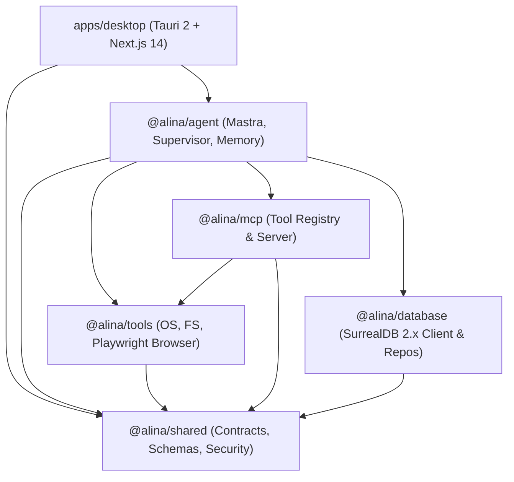

# ALINA Engineering Directives & Architecture Skill

This skill governs all engineering activities within the **ALINA (Autonomous Language Intelligence & Navigation Assistant)** codebase. Every autonomous agent or pair programmer operating on ALINA must adhere to the conventions and constraints outlined below.

---

## 1. Prime Invariants for AI Agents

1. **Inspect Before Modifying**:
   Always read existing implementations, contracts, and tests before making changes. Never rewrite working architecture unnecessarily or replace modular patterns with monolithic shortcuts.
2. **Zero Destructive Operations Without Human Approval**:
   Mutating file operations outside scratch, arbitrary shell execution, system configuration edits, process launches, and sensitive web interactions must trigger the `HitlCoordinator` and await explicit user approval.
3. **Never Bypass Security Controls**:
   Under no circumstances should `PathJail`, `CommandInspector`, Tauri authorization grant tokens, or sandbox validations be disabled or mocked to force tests or workflows to pass.
4. **Canonical Shared Contracts First**:
   All domain entities, tool parameters, IPC schemas, and event payloads must be defined in `@alina/shared` using Zod schemas with TypeScript inference (`z.infer<typeof ...>`).
5. **Mandatory Verification Before Completion**:
   Every agent must run and verify typechecking, linting, unit tests, and desktop compilation before declaring a task complete.

---

## 2. System Architecture & Tech Stack



- **Monorepo Engine**: pnpm workspaces + Turborepo.
- **Frontend / Presentation**: Next.js 14 (App Router), React 18, Tailwind CSS, Lucide icons.
- **Desktop Shell**: Tauri 2.0 (Rust native bridge in `apps/desktop/src-tauri`).
- **Agent Orchestration**: `@alina/agent` powered by Mastra model abstraction and `SupervisorAgent`.
- **Tool Sandbox & Execution**: `@alina/tools` (sandboxed OS commands, filesystem access, Playwright browser automation).
- **Protocol & Extensibility**: `@alina/mcp` (Model Context Protocol server/client with dynamic approval elicitation).
- **Data & Vector Storage**: `@alina/database` (SurrealDB 2.x multi-model database, graph relations, vector search, atomic transactions).
- **Shared Kernel**: `@alina/shared` (Zod schemas, `PathJail`, `CommandInspector`, risk levels, security policies).

---

## 3. Package Boundaries & Responsibilities

| Package / App | Path | Allowed Responsibilities | Forbidden Patterns |
|:---|:---|:---|:---|
| `apps/desktop` | `apps/desktop/` | UI components, pages, visual state, invoking IPC / agent hooks. | **No** direct OS manipulation, raw database queries, or heavy agent planning logic. |
| `@alina/shared` | `packages/shared/` | Zod schemas, canonical types, path sandboxing (`PathJail`), command parsing (`CommandInspector`), risk models. | **No** heavyweight runtime dependencies (Playwright, SurrealDB client, Mastra). |
| `@alina/agent` | `packages/agent/` | Supervisor agent, sub-agent planning, model adapters, episodic/semantic memory coordination. | **No** DOM manipulation or direct desktop window management. |
| `@alina/tools` | `packages/tools/` | Sandboxed tool implementations (filesystem, OS process, browser navigation). | **No** bypassing `PathJail` or executing without `ToolExecutionContext`. |
| `@alina/mcp` | `packages/mcp/` | Model Context Protocol servers, tool registration, operator approval callbacks. | **No** executing `REQUIRES_APPROVAL` tools without eliciting consent. |
| `@alina/database` | `packages/database/` | SurrealDB connection management, schema migrations, typed entity repositories. | **No** non-atomic multi-record mutations without transaction blocks. |

---

## 4. Coding Conventions & Standards

- **Strict TypeScript**: Every package enforces `"strict": true`, `noImplicitAny`, `strictNullChecks`, `noUnusedLocals`, and `noUnusedParameters`.
- **Zero Arbitrary `any`**: Strictly prohibited. Use typed generics, `unknown` with Zod parsing, or strong domain interfaces.
- **Error Handling**: Throw typed, actionable errors. Never silently swallow rejections. When SurrealDB or external services are unreachable, cleanly degrade to offline in-memory fallback and log actionable warnings.
- **Immutability & Pure Helpers**: Favor pure functions for path normalization, prompt formatting, and risk classification.

---

## 5. UI Design & Aesthetics Principles

ALINA's interface embodies **calm, editorial elegance with high information density** (Linear-inspired, Apple-grade minimalism, Arc-like fluidity).

- **Color Palette**:
  - Backgrounds: Dark stone (`#0c0a09`, `#1c1917`) and crisp light alabaster (`#fafaf9`, `#ffffff`).
  - Text: High-contrast warm neutrals (`#f5f5f4`, `#e7e5e4`, `#78716c`).
  - Safety & HITL Accents: Warm amber/copper (`#f59e0b`, `#d97706`).
  - Success / Info: Calm emerald (`#10b981`) and muted slate blue.
- **Strictly Prohibited Visuals**:
  - ❌ Neon cyberpunk purple/cyan glows.
  - ❌ Robotic mascots, floating sparkle balls, or chat bubble fluff.
  - ❌ Raw terminal stack traces or unformatted error dumps in primary views.
- **Accessibility & Interaction**:
  - All modals (`ApprovalModal`, `SettingsModal`) must implement `role="alertdialog"`, `aria-modal="true"`, focus trapping, and `Escape` key dismissal.

---

## 6. SurrealDB & Persistence Conventions

- **Atomic Transactions**:
  Multi-entity mutations (e.g. creating a task, its plan steps, and graph relations) **must** be executed in a SurrealDB transaction:
  ```surrealql
  BEGIN TRANSACTION;
  LET $task = CREATE task CONTENT $taskData;
  LET $step = CREATE plan_step CONTENT $stepData;
  RELATE $task->has_step->$step;
  COMMIT TRANSACTION;
  ```
- **Idempotent Migrations**:
  All schema definitions must be versioned in `packages/database/src/migrations/` and executed via `MigrationRunner`.
- **In-Memory Fallback Parity**:
  The in-memory database mock must support atomic rollback if any step fails, preserving state consistency during offline testing.

---

## 7. Mastra & Core Agent Conventions

- **Model Abstraction**:
  Live model calls are mediated via `MastraModelAdapter`. Tool schemas must be dynamically bound to the agent context.
- **Tool Call Extraction**:
  Always parse structured tool calls across all Mastra output formats (`response.toolCalls`, `response.steps[*].toolCalls`, and `response.toolResults`).
- **Prompt Injection Defense**:
  External or web-crawled content must be sanitized and encapsulated in `<untrusted_web_content origin="...">` XML blocks with boundary directives instructing the model to treat the content purely as passive data.
- **Self-Healing Loop**:
  When a step fails, the agent must employ self-healing (up to 3 retries with exponential backoff) before bubbling up an explanation to the user.

---

## 8. MCP & Tool Execution Conventions

- **Zod Schema Validation**:
  Every MCP tool must validate its input against a strict Zod schema before starting execution.
- **Dynamic Risk Scoring**:
  Tools must evaluate risk based on parameters (e.g., reading a workspace file is `LOW_SAFE`, modifying outside root is `HIGH_DESTRUCTIVE`).
- **Approval Elicitation**:
  When an MCP tool requires approval, the server must invoke `requestApproval()` to elicit operator consent. Never hardcode `{ isApprovalGranted: true }` in production code paths.

---

## 9. Security & Sandbox Rules (Non-Negotiable)

- **`PathJail`**:
  All filesystem tools must validate paths against the active project root. Reject directory traversal (`..`), Alternate Data Streams (`:`), and 8.3 short-name aliases.
- **`CommandInspector`**:
  Shell chaining metacharacters (`[&|;`$`<>()\n\r]`) cannot evaluate as `READ_ONLY`. Compound commands must be classified as `HIGH_DESTRUCTIVE` and gated by HITL.
- **Native Process Spawning**:
  Tauri native app launcher must require a cryptographic or session `grant_token` (`grant_*` / `auth_*`) and enforce strict argument whitelisting.
- **Browser Automation Sandbox**:
  `PlaywrightBrowserManager` must block `file://` protocols, loopback addresses (`127.0.0.1`, `localhost`), RFC 1918 private subnets, and cloud metadata (`169.254.169.254`).
- **Content Security Policy**:
  `tauri.conf.json` must enforce a strict CSP (`script-src 'self'`).

---

## 10. Agent Verification & Self-Check Protocol

Before reporting any task completion, an agent **must** run the following verification sequence in order:

```bash
# 1. Typecheck all monorepo packages
pnpm run typecheck

# 2. Run the full Vitest test suite
pnpm test

# 3. Verify monorepo code linting
pnpm lint

# 4. Verify desktop static build
pnpm --filter @alina/desktop build
```

If any check fails, the agent is responsible for resolving the root cause without weakening security controls.

---

## 11. Deployment & Packaging Rules

- **Native Tauri Distribution**:
  Use `pnpm --filter @alina/desktop tauri build` to package desktop installers (MSI / NSIS on Windows, DMG on macOS, AppImage on Linux).
- **Environment Validation**:
  All runtime environment variables (`SURREAL_URL`, `ALINA_WORKSPACE_ROOT`, `ANTHROPIC_API_KEY`, etc.) must be validated through strict Zod schemas on startup. Never access unvalidated raw `process.env` in domain logic.
- **Static Export Hygiene**:
  Desktop bundling utilizes Next.js static HTML export (`output: 'export'`). API routes used by the web interface must not break static export passes.
- **Production Smoke Checklist**:
  Before tagging any release, the 10-point smoke test in `RELEASE_CHECKLIST.md` must pass (Installation, Launch, Database Connectivity, Agent Connectivity, File Tools, Browser Tools, Approval System, Settings, Voice, Shutdown/Restart).

---

## 12. Documentation Requirements

- **Keep Documentation Synced with Code**:
  Whenever schemas, architectural flows, security boundaries, or tool APIs change, corresponding documentation must be updated immediately:
  - Architecture changes $\rightarrow$ `ARCHITECTURE.md`
  - Security model or threat vector updates $\rightarrow$ `SECURITY.md`
  - Setup or environment variable changes $\rightarrow$ `README.md` and `.env.example`
  - Significant features, bug fixes, or breaking changes $\rightarrow$ `CHANGELOG.md`
- **Clickable Markdown File Links**:
  When communicating with users or generating walkthroughs, always provide clickable Markdown file links (e.g. `[filename](file:///path/to/file)`).
- **No Deceptive Marketing Claims**:
  Document only demonstrated, tested, and active capabilities. Never claim autonomous features that are unbacked by runnable code and verified tests.

