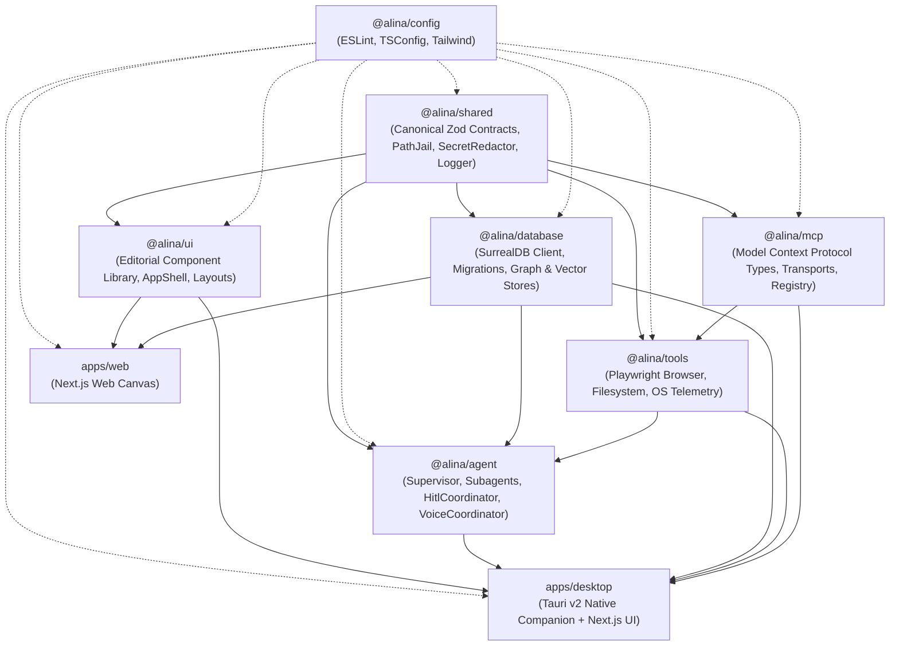
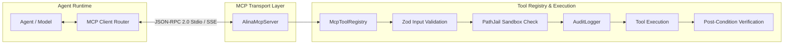
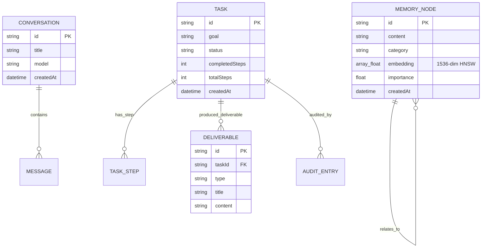
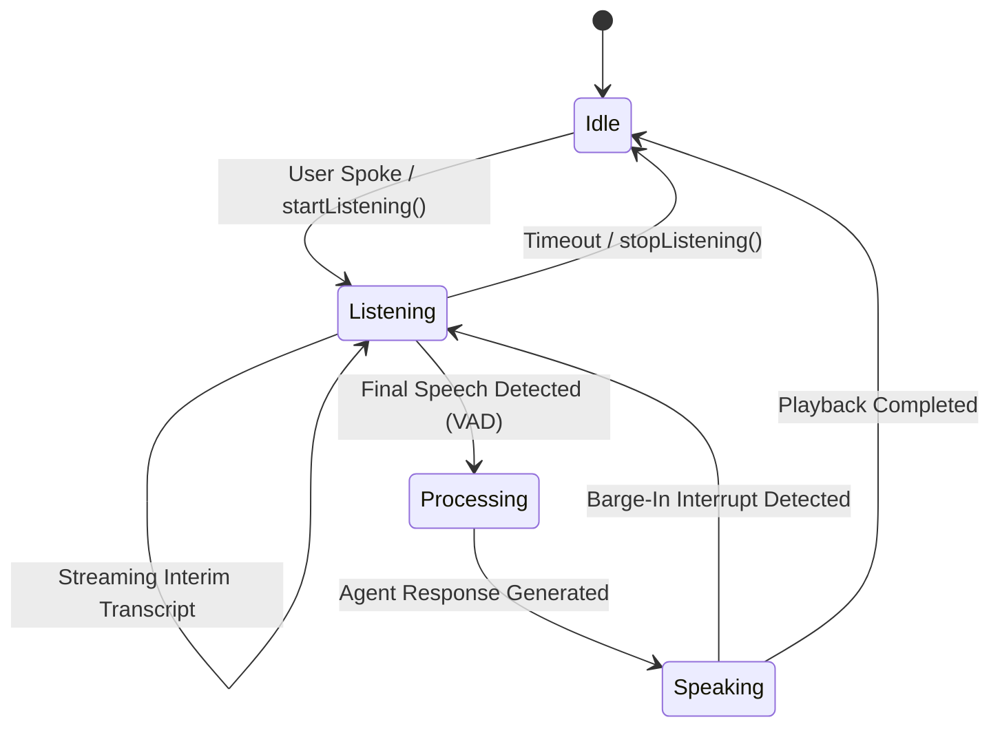

# ALINA Architecture & Technical Specification

> **Scope**: This document provides an exhaustive technical specification of ALINA's system architecture, monorepo package graph, multi-agent orchestration, Model Context Protocol (MCP) tool execution, SurrealDB multi-model persistence, and native Tauri v2 desktop integration.

---

## 1. Monorepo Topology & Dependency Graph

ALINA is structured as a decoupled monorepo managed via **pnpm workspaces** and **Turborepo**. Dependencies flow strictly in one direction from shared foundational contracts up to presentation layers:



### Package Responsibility Matrix

| Package | Purpose & Boundary Invariants |
| :--- | :--- |
| **`@alina/shared`** | **Canonical Foundation**: Single source of truth for domain schemas (Zod), TypeScript types, `PathJail` directory containment, `SecretRedactor`, and `AlinaProductionLogger`. Zero external workspace dependencies. |
| **`@alina/database`** | **State & Memory Engine**: Encapsulates `AlinaDatabaseClient` connecting to SurrealDB v2 (`surrealkv`). Manages schemas, idempotent migrations (`_schema_migrations`), graph relationships, and vector embeddings. |
| **`@alina/mcp`** | **Protocol Interoperability**: Implements the Model Context Protocol (MCP) specification. Provides JSON-RPC 2.0 message parsing, Stdio/SSE transports, and decoupled tool exposure. |
| **`@alina/tools`** | **Sandboxed Capabilities**: Exposes verified tool implementations for Playwright browser automation, jailed filesystem access, and native OS telemetry. Every mutating tool asserts post-conditions. |
| **`@alina/agent`** | **Orchestration & Deliberation**: Contains the `AlinaSupervisorAgent`, specialized subagents (`research`, `browser`, `document`, `filesystem`, `computer`), `HitlCoordinator`, and `AlinaVoiceCoordinator`. |
| **`@alina/ui`** | **Design System**: Editorial component library (AppShell, ConversationLayout, ChatComposer, TaskCard, StatusIndicator, ApprovalDialog) adhering to warm stone neutrals and amber accents. Pure presentation layer. |
| **`apps/desktop`** | **Desktop Companion**: Native application compiled via **Tauri v2** with an embedded Next.js 15 App Router frontend. Bridges webviews to host OS capabilities via native Rust commands. |
| **`apps/web`** | **Web Canvas**: Companion web interface for remote workspace access. |

---

## 2. Multi-Agent Orchestration & Request Lifecycle

ALINA avoids monolithic "all-in-one" LLM executions by separating high-level planning from specialized execution:

```mermaid
sequenceDiagram
    autonumber
    actor User as User (Keyboard / Voice)
    participant UI as Desktop AppShell
    participant Sup as Supervisor Agent
    participant Del as TaskDelegator
    participant Sub as Specialized Subagent
    participant Tool as Sandboxed Tool (MCP)
    participant Jail as PathJail Sandbox
    participant HITL as HitlCoordinator
    participant SDB as SurrealDB Graph

    User->>UI: Dispatches goal ("Research TS 5.8 and write report to ./docs")
    UI->>Sup: execute({ goal, workspaceId })
    Sup->>Sup: shouldDelegate(goal) -> Composite detected
    Sup->>SDB: Persist Task(status: "planning", goal)
    Sup->>Del: delegatePipeline([research, browser, document, filesystem])
    
    rect rgb(28, 25, 23)
        Note over Del,Sub: Subagent Execution Phase
        Del->>Sub: Execute Research Subtask
        Sub->>Tool: Invoke browser_navigate / browser_inspect
        Tool-->>Sub: Structured DOM Content
        Sub-->>Del: ResearchSynthesis Deliverable
        
        Del->>Sub: Execute Document Authoring
        Sub-->>Del: MarkdownReport Deliverable
        
        Del->>Sub: Execute Filesystem Persistence
        Sub->>Tool: fs_write_file("./docs/report.md")
        Tool->>Jail: assertPathAllowed("./docs/report.md")
        Jail-->>Tool: Path Permitted (Inside Workspace Root)
        Tool-->>Del: Write Success (Size: 3,412 bytes)
    end

    Del->>Sup: Aggregate Structured Task Results
    Sup->>Sup: verifyFinalResult(deliverables) -> Assertions Pass
    Sup->>SDB: Persist Task(status: "completed") + Graph Edges
    Sup-->>UI: Stream Completed Deliverable to Conversation
    UI-->>User: Display Formatted Executive Report
```



### Selective Delegation Algorithm
The Supervisor determines delegation using deterministic heuristics:
- **Atomic Tasks** (e.g. single-file read, system info query): Executed directly by the Supervisor without delegating to avoid coordination overhead.
- **Composite Tasks** (e.g. multi-source research, web scraping + document authoring + file writes): Decomposed into an ordered pipeline:
  $$\text{Pipeline} = [\text{Research}] \longrightarrow [\text{Browser}] \longrightarrow [\text{Document}] \longrightarrow [\text{Filesystem}]$$

### Closed-Loop Verification & Self-Healing
Every mutating tool execution asserts post-conditions:
- Filesystem writes verify `fs.stat` exists and byte length matches.
- If an assertion fails, the Supervisor invokes `evaluateRecovery()`:
  - **Attempt < 3**: Retries with exponential backoff and parameter adjustment.
  - **Attempt $\ge$ 3**: Falls back to deterministic cached synthesis.
  - **Permission Denied**: Fails closed immediately without retrying.

---

## 3. Model Context Protocol (MCP) Subsystem

ALINA's tools are decoupled through the standardized Model Context Protocol (MCP):



### Tool Execution Context (`ToolExecutionContext`)
Every tool invocation receives an immutable context containing:
- `pathJail`: Active `PathJail` instance defining permissible filesystem roots.
- `auditLogger`: Append-only audit logger capturing parameters and execution timing.
- `authorizationToken`: Cryptographic single-use token for high-risk operations.

---

## 4. SurrealDB Multi-Model Architecture

ALINA uses SurrealDB as its unified state and memory engine:



### Semantic Memory Vector Search
Memory nodes store 1536-dimensional embeddings generated from user preferences, project context, and past workflow deliverables. Queries execute via SurrealDB's native HNSW cosine vector index:

```surql
SELECT *, vector::similarity::cosine(embedding, $query_vector) AS score
FROM memory_node
WHERE embedding <|10, COSINE|> $query_vector
ORDER BY score DESC;
```

---

## 5. Native Desktop Integration (Tauri v2)

The desktop companion uses **Tauri v2** to interface with native operating system capabilities while keeping the frontend purely presentational:

```
[Next.js 15 Webview UI] 
      │
      │ window.__TAURI__.core.invoke('command_name', payload)
      ▼
[Tauri v2 IPC Dispatcher]
      │
      ├─> get_system_status()       ──> Reports DB, agent, and task counts
      ├─> get_system_metadata()     ──> Reports app version (1.0.0), arch, OS
      ├─> resolve_approval()        ──> Resolves cryptographic HITL token
      ├─> request_app_restart()     ──> Restarts desktop companion cleanly
      └─> capture_native_screenshot() ──> Low-level OS window capture
```

### Native Crash Recovery Hook
In `apps/desktop/src-tauri/src/main.rs`, an unhandled Rust thread panic triggers `setup_crash_handler()`, writing an error dump to `%LOCALAPPDATA%/ALINA/logs/crash.log` and executing graceful cleanup rather than terminating abruptly.

---

## 6. Voice Interaction Subsystem

The voice subsystem weaves speech recognition and synthesis directly into ALINA's agent deliberation pipeline:



- **Streaming Preview**: Emits partial transcriptions for low-latency visual feedback in `ChatComposer`.
- **Barge-in Support**: When a user begins speaking during audio playback, `ttsAdapter.stop()` halts synthesis immediately and switches to listening mode.
