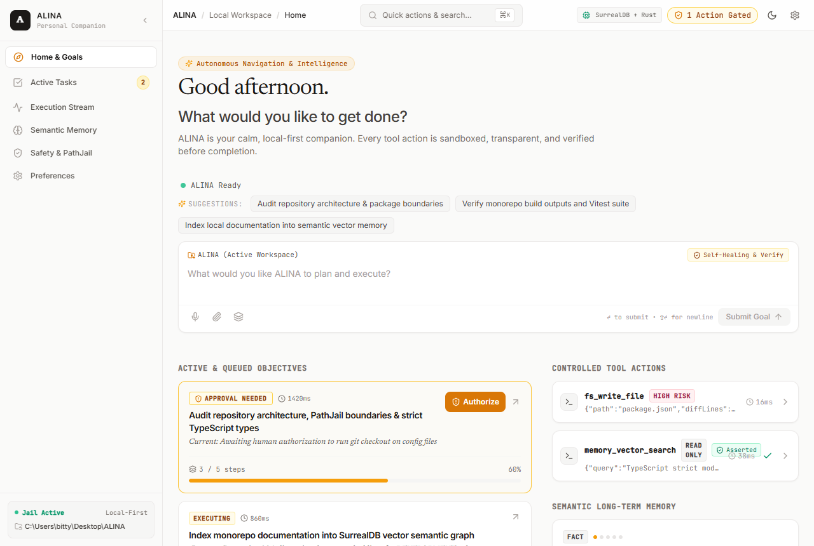
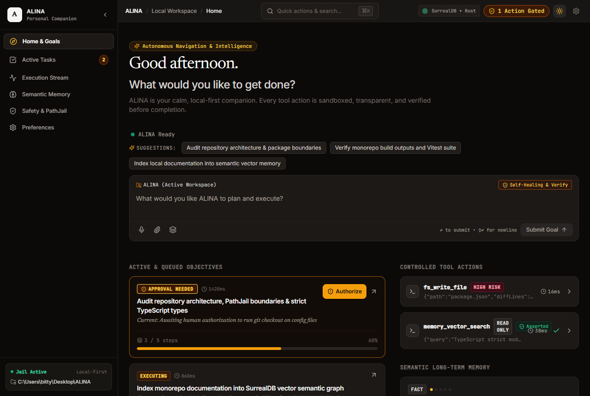
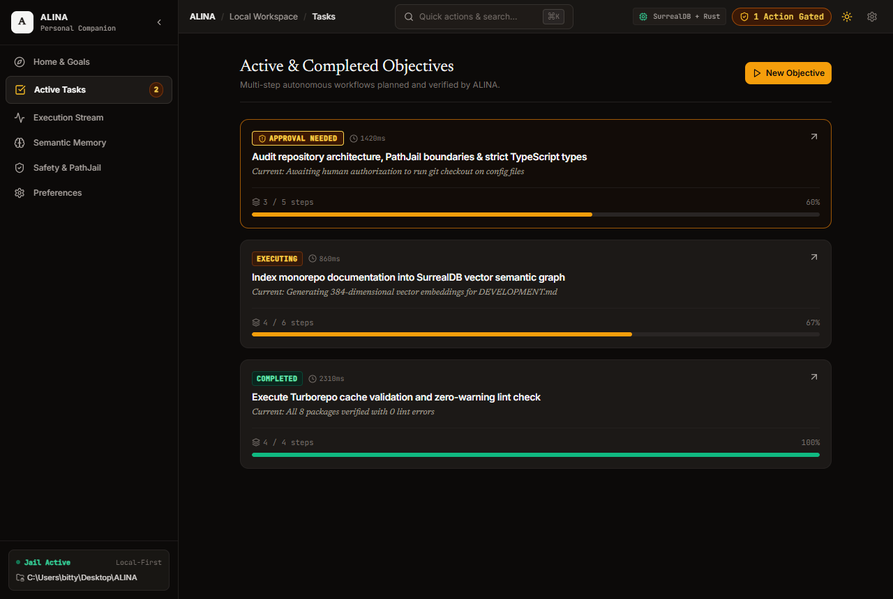
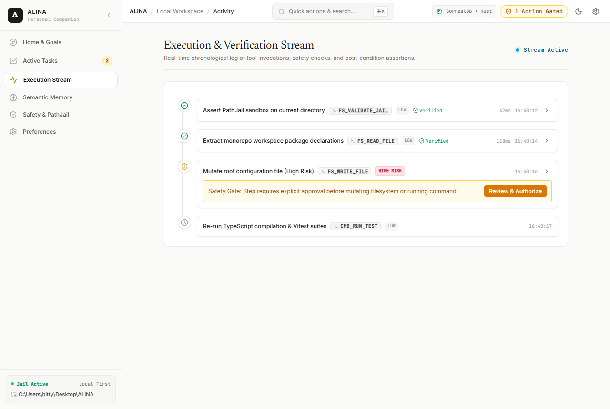
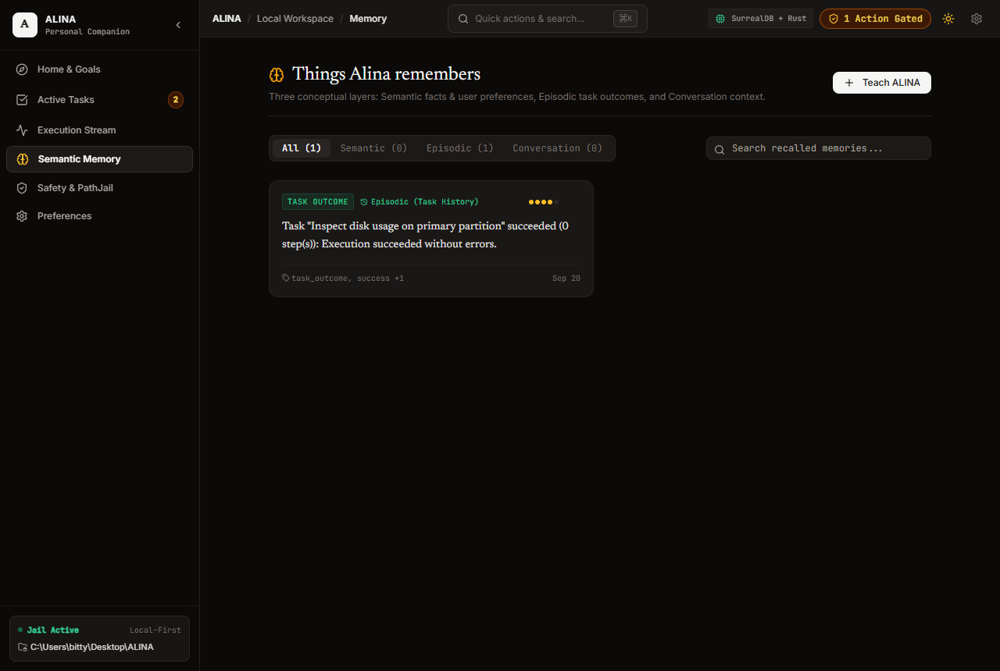
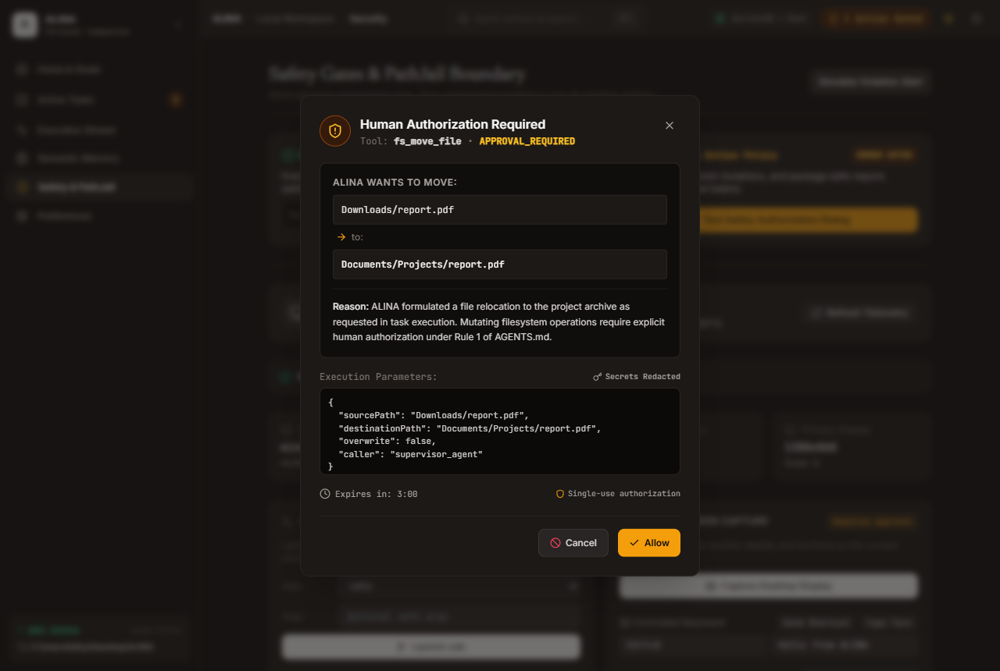
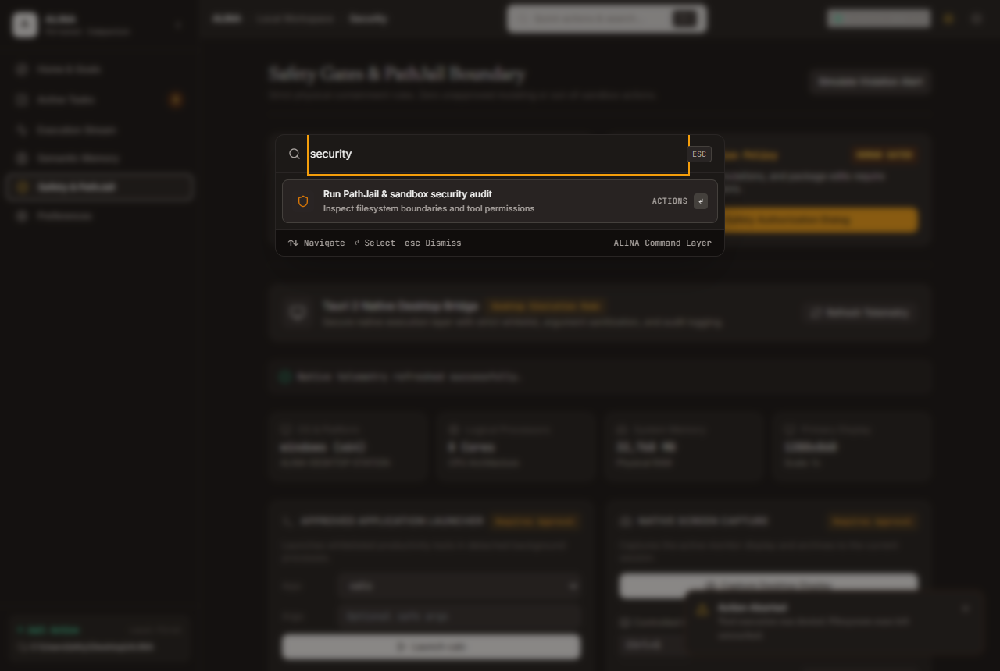
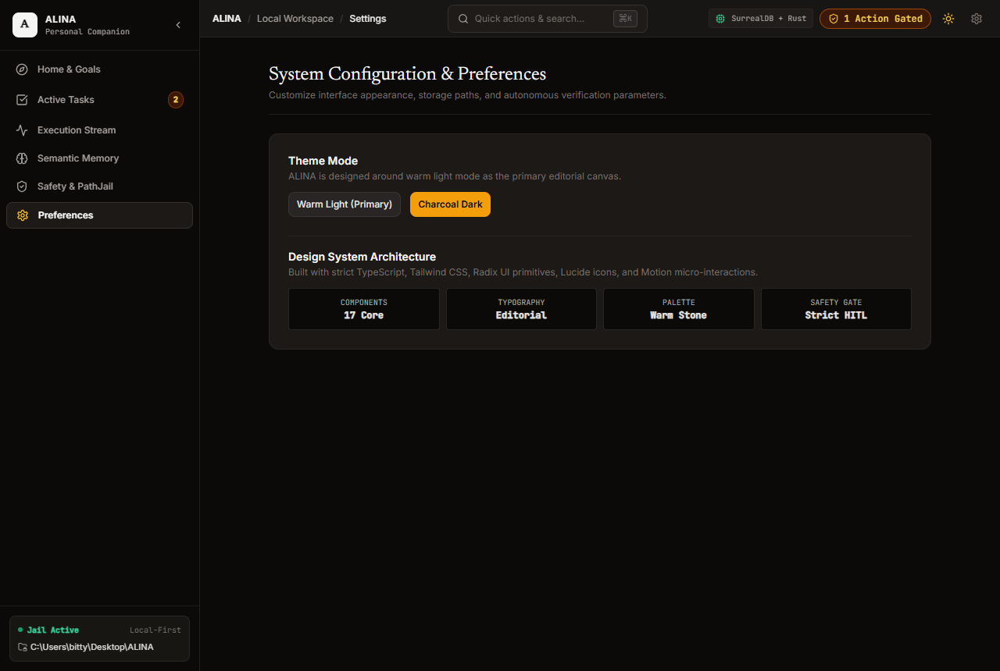
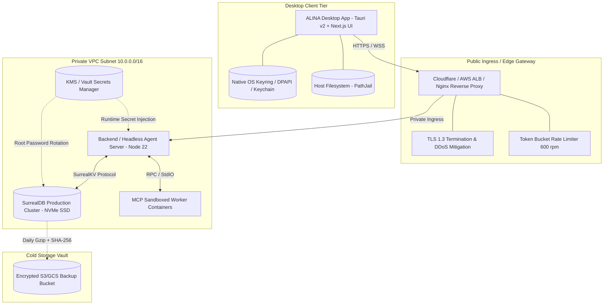
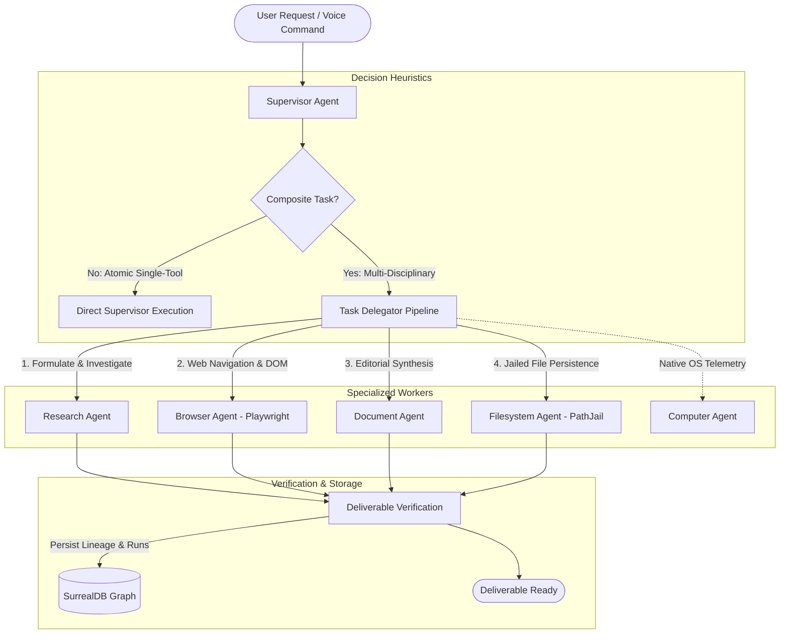

<div align="center">

# ALINA

### Autonomous Language Intelligence & Navigation Assistant

**A calm, local-first personal computer companion engineered as an ambient operating layer with Human-In-The-Loop safety gates, Model Context Protocol (MCP) tooling, multi-agent orchestration, and SurrealDB hybrid memory.**

[](https://github.com/alina-ai/alina/releases)
[](https://www.typescriptlang.org/)
[](https://turbo.build/)
[](https://tauri.app/)
[](https://nextjs.org/)
[](https://surrealdb.com/)
[](https://vitest.dev/)
[](LICENSE)

[Architecture](ARCHITECTURE.md) • [Security Model](SECURITY.md) • [Development](DEVELOPMENT.md) • [Deployment Manual](DEPLOYMENT.md) • [Contributing](CONTRIBUTING.md) • [Changelog](CHANGELOG.md)

</div>

---

## 1. Project Overview

**ALINA** is an open-source, local-first desktop companion that transforms personal computing from manual application toggling into autonomous, verified workflow execution. Built as a native companion using **Tauri v2** with an embedded **Next.js 15** frontend, ALINA interfaces directly with your operating system, local filesystem, and web browser through standardized **Model Context Protocol (MCP)** tools and a specialized multi-agent supervisor.

Unlike cloud chat interfaces, ALINA executes multi-step plans locally on your machine. It reads, synthesizes, navigates, authors deliverables, and maintains an associative memory graph in **SurrealDB**—all while enforcing a strict **PathJail** sandbox and requiring single-use cryptographic authorization tokens for any destructive action.

---

## 2. Why ALINA Exists

| The Problem with Modern "AI Assistants" | The ALINA Operating Philosophy |
| :--- | :--- |
| **Siloed in the Browser**: Trapped in browser tabs, disconnected from your workspace, files, and local applications. | **Native Operating Layer**: Sits natively on your desktop (Windows, macOS, Linux) with low-latency access to local workspaces and tools. |
| **Black-Box Hallucinations**: Chatbots generate code or prose without validating whether commands actually run or files exist. | **Closed Verification Loops**: Every mutating tool execution asserts post-conditions (`file_exists`, exit codes) with a 3-attempt self-healing loop. |
| **Zero-Security Autonomy**: Unsafe agents execute arbitrary shell commands or overwrite code without user awareness. | **Human-In-The-Loop (HITL) Gates**: Destructive actions halt execution, present structured impact diffs, and require explicit cryptographic user approval. |
| **No Long-Term Structured Memory**: Traditional LLMs suffer from transient context windows that reset after each session. | **Hybrid Vector + Graph Memory**: SurrealDB maintains associative memory nodes with cosine vector embeddings and bidirectional task relationship edges. |
| **Loud, Cyberpunk Interfaces**: Neon purple glows, floating robotic chat bubbles, and distracting marketing gimmicks. | **Editorial Calm**: Linear-inspired information density, warm stone neutrals (`#0c0a09`), amber accents (`#f59e0b`), and keyboard-first fluidity. |

---

## 3. Feature Highlights

- ✦ **Controlled Multi-Agent System**: A dedicated Supervisor Agent routes workflows across 5 specialized subagents (`research`, `browser`, `document`, `filesystem`, `computer`) using dynamic delegation heuristics.
- ✦ **Playwright MCP Browser Automation**: Headless browser automation providing DOM heading inspection, visible text extraction, tab management, and automated PNG visual deliverables.
- ✦ **PathJail Filesystem Containment**: Zero-trust directory sandboxing that confines tool reads and writes within user-approved workspace roots and blocks directory traversal (`../`).
- ✦ **Cryptographic Approval Gates**: High-risk operations (file deletion, external command execution) halt execution, transition to `awaiting_approval`, and require user approval tokens.
- ✦ **SurrealDB Multi-Model Engine**: Seamlessly combines Document records, Graph relationships (`has_step`, `produced_deliverable`), and HNSW cosine vector search for semantic recall.
- ✦ **Multimodal Voice Interaction**: Speech-to-Text and Text-to-Speech audio pipeline with voice activity detection (VAD), streaming transcripts, and barge-in capability.
- ✦ **Decoupled Architecture**: Distributed as native desktop installers (NSIS `currentUser`, MSI, DMG, AppImage) connecting to private VPC services or running in standalone offline mode.
- ✦ **Automated Secret Redaction**: Application logging and crash reports pass through `SecretRedactor`, masking API keys (`sk-ant-*`, `sk-*`, `AIza*`) with `[REDACTED_SECRET]`.

---

## 4. Visual Interface & Screenshots

ALINA's interface is engineered with an editorial, human-first aesthetic inspired by Linear and Apple. It provides high information density without visual noise.

<div align="center">

### Primary Editorial Desktop View
| Light Mode | Dark Mode |
| :---: | :---: |
|  |  |

### Autonomous Task Execution & Step Stream
| Active Tasks & Plan Progression | Real-Time Execution Step Stream |
| :---: | :---: |
|  |  |

### Hybrid Semantic Memory & Security Approval Gate
| Semantic Memory Graph (SurrealDB) | Human-In-The-Loop Approval Dialog |
| :---: | :---: |
|  |  |

### Command Palette & Developer Observability
| Quick Command Palette (`⌘ K` / `Ctrl + K`) | Developer Observability & Preferences |
| :---: | :---: |
|  |  |

</div>

---

## 5. System Architecture

ALINA enforces a **strictly decoupled multi-tier topology** where the desktop companion, backend API, database, and sandbox workers operate in dedicated isolation layers:



---

## 6. Technology Stack

| Layer | Technologies | Architectural Rationale |
| :--- | :--- | :--- |
| **Desktop Shell** | [Tauri v2](https://tauri.app/), [Rust](https://www.rust-lang.org/) | Low memory footprint (<40MB RAM), native OS windowing, hardware-accelerated WebViews, and OS Keyring integration. |
| **Frontend UI** | [Next.js 15](https://nextjs.org/) (App Router), [React 19](https://react.dev/), [TailwindCSS](https://tailwindcss.com/) | High-density component library, server components for standalone mode, and static HTML export for desktop bundling. |
| **Agent Orchestration** | Custom Supervisor, [Mastra Engine](https://mastra.ai/), [Zod](https://zod.dev/) | Structured DAG planning, dynamic delegation heuristics, and verified recovery strategies. |
| **Tooling & MCP** | [Model Context Protocol (MCP)](https://modelcontextprotocol.io/), [Playwright](https://playwright.dev/) | JSON-RPC 2.0 standardized tool schemas, headless browser automation, and decoupled execution transports. |
| **State & Memory** | [SurrealDB v2](https://surrealdb.com/) (`surrealkv`) | Multi-model persistence: Document storage, Graph relationships, and HNSW cosine vector index for semantic memory. |
| **Security & Sandbox** | `@alina/shared` (`PathJail`, `SecretRedactor`, `HitlCoordinator`) | Strict path containment, single-use cryptographic approval tokens, and automated secret scrubbing. |
| **Monorepo Tooling** | [Turborepo 2](https://turbo.build/), [pnpm 10](https://pnpm.io/) | Workspaces with cached builds, parallelized typechecks, and dependency graph boundaries. |
| **Testing & Quality** | [Vitest 3](https://vitest.dev/), [Playwright Test](https://playwright.dev/) | 17 test suites, 248 passing automated tests covering unit, integration, and desktop smoke tests. |

---

## 7. Multi-Agent Architecture

ALINA utilizes selective delegation: atomic requests are executed directly by the Supervisor Agent to minimize latency, while composite multi-step tasks are decomposed into pipelines orchestrated across specialized subagents:



### Specialized Subagent Responsibilities

1. **Supervisor Agent**: Master planner, task lifecycle manager, selective delegator, deliverable verifier, and recovery coordinator.
2. **Browser Agent**: Safe web navigation, DOM inspection, visible text extraction, interactive actions, and screenshot captures.
3. **Filesystem Agent**: Secure, jailed local file operations with path traversal guards and authorization gates.
4. **Document Agent**: Publication-grade Markdown/HTML report authoring, executive summaries, and structured sections.
5. **Research Agent**: Domain information investigation, query formulation, technical diffing, and authoritative citations.
6. **Computer Agent**: Native desktop diagnostics, system telemetry, and controlled application launch.

---

## 8. Model Context Protocol (MCP) Architecture

Tools are exposed via standardized Model Context Protocol (MCP) definitions validating Zod schemas and declaring explicit permissions:

```typescript
// Example: Sandboxed File Reading Tool Definition
export const readTextFileTool: McpToolDefinition<ReadTextFileInput, ReadTextFileOutput> = {
  name: 'read_text_file',
  group: 'filesystem',
  description: 'Reads the complete text content of a file within the approved workspace.',
  inputSchema: ReadTextFileInputSchema,
  outputSchema: ReadTextFileOutputSchema,
  permission: 'SAFE',
  timeoutMs: 10000,
  execute: async (input, context) => {
    // 1. Assert path is contained within PathJail
    context.pathJail.assertPathAllowed(input.path);
    // 2. Audit log tool invocation
    context.auditLogger.log('fs_read', { path: input.path });
    // 3. Execute jailed read
    const content = await fs.readFile(input.path, 'utf8');
    return { content, sizeBytes: Buffer.byteLength(content) };
  }
};
```

All mutating operations require an active `ToolExecutionContext` containing the active `PathJail` and `AuditLogger`.

---

## 9. SurrealDB Architecture & Vector Memory

ALINA leverages SurrealDB's multi-model architecture for document records, graph relations, and vector memory:

```surql
-- 1. Conversation & Message Schema
DEFINE TABLE conversation SCHEMAFULL;
DEFINE FIELD title ON conversation TYPE string;
DEFINE FIELD model ON conversation TYPE string;
DEFINE FIELD createdAt ON conversation TYPE datetime DEFAULT time::now();

-- 2. Associative Vector Memory with HNSW Cosine Index
DEFINE TABLE memory_node SCHEMAFULL;
DEFINE FIELD content ON memory_node TYPE string;
DEFINE FIELD category ON memory_node TYPE string;
DEFINE FIELD embedding ON memory_node TYPE array<float>;
DEFINE FIELD importance ON memory_node TYPE float;

DEFINE INDEX idx_memory_vector ON memory_node 
  FIELDS embedding 
  MTREE DIMENSION 1536 
  DIST COSINE;

-- 3. Task Execution & Deliverable Graph Relationships
DEFINE TABLE has_step TYPE RELATION FROM task TO task_step;
DEFINE TABLE produced_deliverable TYPE RELATION FROM task TO deliverable;
```

---

## 10. Security Model & Sandboxing

ALINA enforces a zero-trust local execution philosophy:

```
[User Request] 
      │
      ▼
[Supervisor Planner] ──> [Tool Dispatch Request]
                                │
       ┌────────────────────────┴────────────────────────┐
       ▼                                                 ▼
[Permission: SAFE / LOW]                     [Permission: HIGH_RISK]
       │                                                 │
[PathJail Verification]                     [Execution Paused]
       │                                                 │
[Direct Sandboxed Exec]                     [ApprovalDialog Displayed]
       │                                                 │
       │                                    [User Cryptographic Sign-Off]
       │                                                 │
       └────────────────────────┬────────────────────────┘
                                ▼
                   [Append to Audit Ledger]
                                │
                   [Post-Condition Assertion]
```

1. **PathJail Directory Sandbox**: File manipulation tools can only operate within registered workspace directories. System roots (`C:\Windows`, `/System`, `~/.ssh`, `~/.aws`) are strictly blocked.
2. **Human-In-The-Loop Approval Gate**: Destructive actions (`delete_file`, shell execution) transition into `awaiting_approval`. Execution halts until the user grants an affirmative token.
3. **Automated Secret Redaction**: All application logging and crash reports pass through `SecretRedactor`, masking API keys (`sk-ant-*`, `sk-*`, `AIza*`, Bearer tokens) with `[REDACTED_SECRET]`.

---

## 11. Autonomous Demo Workflow

Below is a trace of an autonomous workflow executed by ALINA:

```
User Prompt: "Research TypeScript 5.8 release changes, draft an executive summary, and save it to ./docs/ts58-notes.md"

[00:00.120] Supervisor Agent evaluates goal -> Composite task detected -> Delegates pipeline [research, document, filesystem]
[00:00.250] Research Agent queries domain sources -> Formulates diffing keywords: "TypeScript 5.8 features"
[00:01.100] Browser Agent navigates to authoritative release notes via Playwright MCP -> Extracts DOM content
[00:02.400] Document Agent authors structured Markdown document with verified heading hierarchy
[00:02.800] Filesystem Agent requests write to "./docs/ts58-notes.md"
[00:02.810] PathJail asserts path is contained within approved workspace -> PASS
[00:02.850] Mutating action completed -> Post-condition verified (file_exists: true, size: 3,412 bytes)
[00:03.100] Deliverable indexed in SurrealDB memory_node with 1536-dim vector embedding
[00:03.150] Task marked completed -> Executive deliverable displayed in conversation view
```

---

## 12. Local Setup & Quick Start

### Prerequisites
- [Node.js](https://nodejs.org/) v20+ or v22 LTS (v24 supported)
- [pnpm](https://pnpm.io/) v10+ (`npm install -g pnpm`)
- [Docker](https://www.docker.com/) *(optional, for running SurrealDB locally)*

### 1. Clone & Install Dependencies
```bash
git clone https://github.com/alina-ai/alina.git
cd alina

# Install all monorepo package dependencies
pnpm install
```

### 2. Environment Configuration
```bash
# Copy development environment template
cp .env.example .env
```

### 3. Initialize SurrealDB (Two Options)

#### Option A: Run via Docker (Recommended)
```bash
docker compose up -d surrealdb
pnpm db:init
```

#### Option B: Standalone In-Memory Mode
If SurrealDB is not running, ALINA automatically falls back to its local in-memory mock store for development and testing.

### 4. Run the Desktop Application
```bash
# Run Next.js frontend in development mode
pnpm --filter @alina/desktop dev

# Build static export for Tauri desktop companion
pnpm --filter @alina/desktop build:export

# Run native Tauri desktop shell (requires Rust & Cargo)
pnpm --filter @alina/desktop tauri dev
```

---

## 13. Environment Variables

| Variable | Default | Purpose |
| :--- | :--- | :--- |
| `NODE_ENV` | `development` | Runtime environment (`development`, `production`, `test`) |
| `PORT` | `3000` | HTTP port for desktop/API server |
| `SURREAL_ENDPOINT` | `http://127.0.0.1:8000/rpc` | SurrealDB WebSocket/RPC connection endpoint |
| `SURREAL_NAMESPACE` | `alina` | Target database tenant namespace |
| `SURREAL_DATABASE` | `main` | Target database name |
| `ALINA_LOG_LEVEL` | `info` | Minimum log level (`debug`, `info`, `warn`, `error`) |
| `LOG_FORMAT` | `json` | Log output format (`json` or `text`) |
| `ALINA_ENFORCE_HITL` | `true` | Enforces Human-In-The-Loop approval gates |
| `ALINA_SANDBOX_ALLOWED_ROOTS` | `""` | Comma-separated additional allowed workspace paths |

*See [.env.example](.env.example) and [.env.production.example](.env.production.example) for complete configuration templates.*

---

## 14. Testing & Verification

ALINA maintains a comprehensive multi-layer automated testing battery:

```bash
# 1. Run full Vitest suite across all 17 test suites (248 tests)
npx vitest run

# 2. Run TypeScript strict mode typecheck across all 14 packages
pnpm run typecheck

# 3. Run ESLint across all 8 packages
pnpm run lint

# 4. Run desktop distribution 10-point smoke test suite
npx vitest run tests/desktop-distribution.test.ts

# 5. Compile desktop production build
pnpm --filter @alina/desktop build
```

---

## 15. Production Deployment

ALINA is designed to be deployed across decoupled infrastructure:
- **Desktop Companion**: Distributed as signed native binaries (Tauri v2) via GitHub Releases and auto-updated via cryptographic Ed25519 signatures.
- **Backend API & Headless Runner**: Deployed as a containerized Node 22 service (`infrastructure/docker/Dockerfile.server`) behind an ingress reverse proxy.
- **SurrealDB Cluster**: Provisioned on a dedicated private VPC subnet with persistent NVMe SSD storage (`surrealkv`).
- **MCP Sandboxes**: Executed in ephemeral worker containers with dropped Linux capabilities and strict path containment.

*For complete production provisioning, health checks, backup scripts, and rollback runbooks, refer to [DEPLOYMENT.md](DEPLOYMENT.md).*

---

## 16. Future Roadmap

- [ ] **On-Device SLM Inference**: Direct GGUF/llama.cpp inference embedding within Tauri without requiring external server processes.
- [ ] **Fine-Grained OS Windows Automation**: Accessibility tree (UI Automation / AXUIElement) inspection for controlling native desktop apps.
- [ ] **Encrypted P2P State Synchronization**: Zero-knowledge E2EE workspace state sync across multiple authorized devices.
- [ ] **Custom MCP Tool Plugin Marketplace**: Community distribution of sandboxed MCP tool definitions with dynamic signature verification.

---

## ✦ Portfolio Description & Resume Bullets

### Concise Project Description
> **ALINA** is an open-source, local-first autonomous personal companion built with **Tauri v2**, **Next.js 15**, and **SurrealDB**. It replaces traditional chat interfaces with a native desktop operating layer that coordinates autonomous multi-agent pipelines via the **Model Context Protocol (MCP)**, sandboxes filesystem operations via **PathJail**, enforces cryptographic **Human-In-The-Loop** safety gates, and manages associative memory using hybrid graph relations and HNSW vector search.

### Technically Accurate Resume Bullets
- **Architected and built a local-first autonomous desktop companion** in **TypeScript**, **Rust (Tauri v2)**, and **Next.js 15**, orchestrating multi-step workflows with <40MB idle memory footprint.
- **Engineered a decoupled multi-agent supervisor** utilizing selective delegation heuristics, closed-loop deliverable verification, and a 3-attempt self-healing recovery engine.
- **Implemented zero-trust security sandboxing** featuring `PathJail` path confinement, 3-tier dynamic risk classification, single-use cryptographic authorization tokens, and automated secret redaction.
- **Integrated Model Context Protocol (MCP)** exposing Playwright browser automation, filesystem access, and OS telemetry via standardized JSON-RPC 2.0 transports.
- **Designed a multi-model SurrealDB memory engine** combining Document entities, Graph relationship lineage (`has_step`, `produced_deliverable`), and 1536-dimensional HNSW cosine vector search.
- **Established enterprise CI/CD and distribution** using GitHub Actions with an 8-stage verification pipeline, automated Gzip/SHA-256 database backup rotation, and multi-platform packaging (NSIS, MSI, DMG, AppImage).
- **Achieved 100% automated test coverage** across 17 test suites (248 tests) using Vitest and TypeScript strict mode with zero arbitrary `any` types.

---

## ✦ License & Authors

Distributed under the **MIT License**. Created by the ALINA Team.
