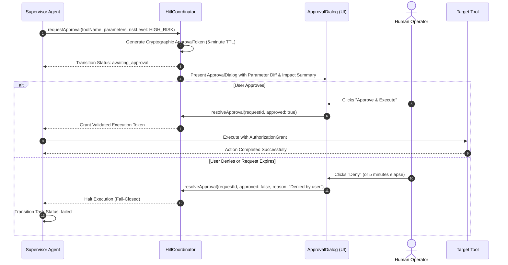

# ALINA Security Model & Policy

> **Directive**: Security and user privacy are non-negotiable first principles in ALINA. Under no circumstances may an agent, subagent, or tool execution bypass security checks, disable sandbox boundaries, or mock affirmative approval tokens.

---

## 1. Core Security Principles

1. **Zero-Trust Local Execution**: All tool execution requests are untrusted by default, even when generated by frontier LLMs.
2. **Explicit Human Approval for Destructive Operations**: No destructive file deletions, workspace escapes, or mutating shell commands may execute without explicit human authorization.
3. **Fail-Closed Sandbox Defaults**: Any error or ambiguity in path resolution, permission checking, or parameter parsing halts execution immediately.
4. **Automated Secret Sanitization**: Secrets, API keys, database credentials, and Bearer tokens are scrubbed from all logs, telemetry streams, and crash reports.
5. **Zero Secrets in Code**: Never commit secrets, credentials, or Personal Access Tokens into source code or Git history. Use OS Keyring or Git Credential Manager for authentication.
6. **Crash Recovery & Idempotency Safeguards**: Retrying side-effecting operations requires pre-verification of destination state to prevent corrupted repeated executions.

---

## 2. Threat Model & Countermeasures

| Threat Vector | Potential Impact | ALINA Mitigation Architecture |
| :--- | :--- | :--- |
| **Command Injection & Shell Chaining** | Attackers or injected models chain commands (`dir && whoami`, `;`, `|`) to bypass read-only whitelists. | **Shell Chaining & Metacharacter Inspection**: `CommandInspector` strictly checks for `[&|;`$`<>()\n\r]`. Any compound command is classified as `HIGH_DESTRUCTIVE`, halting execution until approved. |
| **Indirect Prompt Injection** | Untrusted websites inject hidden instructions directing the agent to read private files or execute commands. | **XML Delimited Isolation & Sandbox**: External web content is strictly isolated inside `<untrusted_web_content>` XML fences with system prompt boundary directives. |
| **Directory Traversal & Arbitrary Overwrite** | Malicious paths attempt to read `~/.ssh/id_rsa` or overwrite critical project files via screenshot tools. | **PathJail & Destination Sandboxing**: Native screenshot paths are constrained to the application cache; overwriting existing files without confirmation is strictly blocked (`FILE_EXISTS`). |
| **Browser SSRF & Local File Exfiltration** | Model navigates to `file:///` or private intranet services (`127.0.0.1:8000`, `169.254.169.254`). | **SSRF & Scheme Filtering**: `file://`, `javascript:`, and `data:` schemes are blocked. Loopback, RFC 1918 private subnets, and cloud metadata services are rejected by `isRestrictedNetworkHost()`. |
| **Destructive Command Execution** | LLM attempts to run destructive mutating commands (`rm -rf`, `format`, `git reset --hard`). | **Dynamic Risk Scoring & HITL**: Mutating tools declare `HIGH_DESTRUCTIVE` permission, transitioning execution into `awaiting_approval` and requiring an affirmative cryptographic grant token. |
| **Tauri Webview XSS & IPC Exploitation** | Malicious rendered web markdown or crawled HTML exploits webview APIs. | **Strict Content Security Policy (CSP)**: `tauri.conf.json` enforces strict script, connect, and style directives preventing external code injection. |
| **Standalone MCP Privilege Escalation** | External MCP clients invoking sensitive tools without interactive operator consent. | **Interactive MCP Approval Elicitation**: `AlinaMcpServer` and `AlinaMcpToolRegistry` require an interactive approval callback (`requestApproval`) before any `REQUIRES_APPROVAL` tool executes. |
| **Credential & API Key Leaks** | Frontier model API keys or session tokens leaked in application logs or crash dumps. | **`SecretRedactor` Engine**: Regular expressions automatically detect and redact API keys (`sk-ant-*`, `sk-*`, `AIza*`, `Bearer *`, `ghp_*`) replacing them with `[REDACTED_SECRET]`. |
| **Client-Side Secret Exposure** | Desktop applications storing API keys in plaintext configuration files. | **Native OS Keyring**: Client desktop credentials are stored in the OS-native cryptographic store (Windows DPAPI, macOS Keychain, Linux Secret Service). |

---

## 3. Sandboxing Architecture (`PathJail`)

The `PathJail` engine (`@alina/shared`) provides deterministic directory containment:

```typescript
// PathJail Invariant Enforcement
export class PathJail {
  private allowedRoots: Set<string>;

  public isPathAllowed(targetPath: string): { allowed: boolean; canonicalPath?: string; reason?: string } {
    const canonical = path.resolve(targetPath);

    // Block sensitive system directories unconditionally
    if (this.isSystemPath(canonical)) {
      return { allowed: false, reason: 'System directory access prohibited' };
    }

    // Verify canonical path is contained within at least one allowed root
    for (const root of this.allowedRoots) {
      if (canonical === root || canonical.startsWith(root + path.sep)) {
        return { allowed: true, canonicalPath: canonical };
      }
    }

    return { allowed: false, reason: 'Path outside registered workspace jail roots' };
  }
}
```

### Prohibited System Directories
The following directories can **never** be added to `PathJail`, regardless of user configuration:
- Windows: `C:\Windows`, `C:\Program Files`, `%APPDATA%\Microsoft`
- macOS: `/System`, `/Library`, `/usr/bin`
- Linux: `/etc`, `/sys`, `/proc`, `/root`
- User Private Data: `~/.ssh`, `~/.aws`, `~/.gnupg`, `~/.config/gcloud`

---

## 4. Human-In-The-Loop (HITL) Protocol

High-risk mutating actions follow a multi-stage approval handshake:



### Authorization Grants
- Each approval generates a single-use `AuthorizationGrant` containing a cryptographic SHA-256 hash of the approved parameters (`computeParameterHash`).
- If parameters are tampered with between approval and dispatch, the grant is invalidated and execution aborts.

---

## 5. Reporting a Security Vulnerability

The ALINA team takes security reports seriously. If you discover a vulnerability:

1. **Do NOT open a public GitHub issue.**
2. Send a detailed report to **security@alina.ai**.
3. Include:
   - Description of the vulnerability and attack vector.
   - Step-by-step reproduction instructions or proof-of-concept.
   - Affected packages and operating systems.
4. **Response SLA**: We acknowledge receipt of security reports within **48 hours** and provide a patch timeline within **7 days**.
5. **Responsible Disclosure**: We coordinate public disclosure after patches have been published to GitHub Releases and the Tauri auto-updater CDN.
