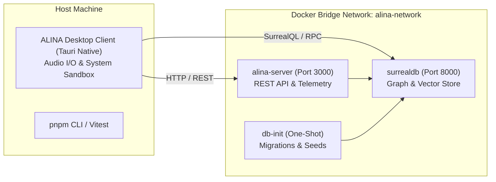

# ALINA Infrastructure & Local Setup Guide

> **Target Audience**: Engineers and operators setting up the **ALINA (Autonomous Language Intelligence & Navigation Assistant)** infrastructure on a clean machine.

---

## 1. Prerequisites

Ensure the following tools are installed on your host machine before beginning:

| Requirement | Minimum Version | Recommended | Purpose |
| :--- | :--- | :--- | :--- |
| **Operating System** | Windows 10/11, macOS 13+, Ubuntu 22.04+ | Windows 11 / macOS Sonoma | Host runtime |
| **Node.js** | `v20.x` or `v22.x` | `v22.x LTS` | Monorepo runtime & scripts |
| **pnpm** | `v9.x` or `v10.x` | `v10.12.4` (via Corepack) | Fast, deterministic package manager |
| **Docker Desktop** | `v24.x+` (Compose v2) | Latest Docker Desktop | Containerized SurrealDB & server |
| **Rust & Cargo** | `1.80+` | Stable channel | *(Optional)* Only if compiling native Tauri desktop shell from source |

---

## 2. Architecture & Containerization Boundary

ALINA follows a clean architectural decoupling:
- **Containerized Infrastructure**:
  - `surrealdb`: Multi-model database storing conversation graphs, tasks, episodic memories, and vector embeddings.
  - `alina-server`: Headless Node.js application server hosting REST endpoints (`/api/telemetry`, `/api/health`, `/api/tasks`, `/api/approvals`).
  - `db-init`: One-shot container executing schema definitions and idempotent migrations.
- **Native Host Client (Not Containerized)**:
  - `apps/desktop/src-tauri`: The desktop client remains native on the host system to retain direct access to OS windowing, tray icons, audio hardware for real-time voice interaction, and native sandboxing without container virtualization overhead.



---

## 3. Clean Machine Setup: Step-by-Step

### Step 1: Clone the Repository
```bash
git clone https://github.com/alina-assistant/alina.git
cd alina
```

### Step 2: Configure Environment Variables
Copy the secret-free template to create your local `.env`:
```bash
cp .env.example .env
```
> [!NOTE]
> `.env.example` contains safe local defaults and zero real secrets. Fill in optional model provider keys (`ANTHROPIC_API_KEY`, `OPENAI_API_KEY`) if evaluating LLM providers locally.

### Step 3: Enable Corepack & Install Dependencies
```bash
# Enable pnpm via Corepack
corepack enable
corepack prepare pnpm@10.12.4 --activate

# Install all monorepo dependencies
pnpm install
```

---

## 4. Starting the Infrastructure

### Option A: Development Environment (Live Reloading)
Spins up SurrealDB with debug logging and the ALINA application server with live workspace volume mounts:
```bash
pnpm docker:dev
# Or directly via docker compose:
docker compose -f docker-compose.yml -f docker-compose.dev.yml up
```

### Option B: Production-Like Environment (Optimized & Hardened)
Spins up SurrealDB with persistent storage and a hardened, standalone multi-stage production container:
```bash
pnpm docker:prod
# Or directly via docker compose:
docker compose -f docker-compose.yml -f docker-compose.prod.yml up -d
```

To stop all containers:
```bash
pnpm docker:down
```

---

## 5. Database Initialization & Migrations

Once SurrealDB is up, initialize the canonical schema (`schema.surql`), create table relationships, and apply migrations:

### Running on Host:
```bash
# Initialize schema & run idempotent migrations:
pnpm db:init

# Initialize schema AND populate development fixtures (users, tasks, memories):
pnpm db:seed
```

### Running via Docker Container:
```bash
# Execute the db-init container:
pnpm docker:db:init

# Execute with development seed fixtures:
pnpm docker:db:seed
```

---

## 6. Health & Verification Checklist

Verify that all services are operational:

1. **SurrealDB Health**:
   ```bash
   curl http://localhost:8000/health
   # Returns: OK
   ```

2. **Application Server Health**:
   ```bash
   curl http://localhost:3000/api/health
   # Returns: {"success":true,"data":{"status":"online",...}}
   ```

3. **Developer Observability Endpoint**:
   ```bash
   curl http://localhost:3000/api/telemetry
   # Returns: {"success":true,"metrics":{...},"spans":[...]}
   ```

4. **Web & Observability Interface**:
   Open [http://localhost:3000](http://localhost:3000) in your browser to inspect the application and telemetry dashboard.

---

## 7. Launching the Native Desktop Client

With the containerized backend running, start the native Tauri desktop shell on the host:
```bash
# Run desktop client in development mode
pnpm --filter @alina/desktop tauri dev
```

---

## 8. Operational Commands Reference

| Workflow | Command | Description |
| :--- | :--- | :--- |
| **Development** | `pnpm docker:dev` | Starts SurrealDB & Server in dev mode with volume mounts. |
| **Production Run** | `pnpm docker:prod` | Starts production-hardened background containers. |
| **Build Images** | `pnpm docker:build` | Compiles multi-stage production Docker images. |
| **Tear Down** | `pnpm docker:down` | Stops and removes all project containers. |
| **Database Init** | `pnpm db:init` | Runs migration runner and applies canonical schema. |
| **Database Seed** | `pnpm db:seed` | Populates development mock graph and memory vectors. |
| **Test Suite** | `pnpm test` | Runs the full Vitest suite (14 test files, 200+ tests). |
| **Type Check** | `pnpm run typecheck` | Validates TypeScript strict mode across all 14 packages. |
| **Desktop Build** | `pnpm --filter @alina/desktop build` | Compiles Next.js desktop app production bundle. |

---

## 9. Troubleshooting & FAQ

### 1. `failed to connect to docker API / daemon is not running`
- **Cause**: Docker Desktop is not launched.
- **Resolution**: Open Docker Desktop from your system tray or application launcher and wait for the status indicator to turn green.

### 2. `SurrealDB connection refused on port 8000`
- **Cause**: Another process or previous SurrealDB instance is occupying port 8000.
- **Resolution**: Check active listeners:
  - Windows: `Get-NetTCPConnection -LocalPort 8000`
  - macOS/Linux: `lsof -i :8000`
  - Update `DOCKER_SURREALDB_PORT=8001` in `.env` if needed.

### 3. Resetting Persistent Database Data
To wipe the database volume and start fresh:
```bash
docker compose down -v
# Or remove volume explicitly:
docker volume rm alina-surreal-data
```
