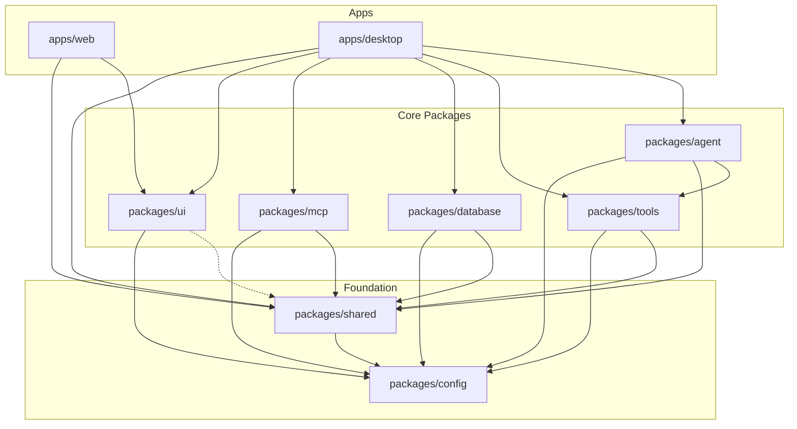

# ALINA Monorepo Architecture & Organization

This document details the exact repository structure, package boundaries, and project references for **ALINA (Autonomous Language Intelligence & Navigation Assistant)**.

---

## 1. Directory Tree

```
alina/
├── apps/
│   ├── web/                     # Next.js 15 Web Companion Portal
│   └── desktop/                 # Tauri 2 Desktop Shell + Next.js App
│
├── packages/
│   ├── config/                  # Shared TSConfig presets, ESLint, Prettier
│   ├── shared/                  # Canonical Zod schemas, models, sandbox jail, errors
│   ├── ui/                      # Shared React design system (Button, Badge, Card, tokens)
│   ├── database/                # SurrealDB multi-model client, schemas, repositories
│   ├── tools/                   # Sandboxed filesystem & OS tools, dynamic risk scoring
│   ├── mcp/                     # Model Context Protocol types, client interfaces, contracts
│   └── agent/                   # Agent roles, HITL coordinator, verification engine
│
├── infrastructure/
│   └── docker/                  # Docker Compose configuration (SurrealDB daemon)
│
├── docs/                        # Architecture, security, and developer documentation
│
├── tests/                       # Monorepo unit & integration verification tests
├── package.json                 # Root workspace manifest & orchestrator
├── pnpm-workspace.yaml          # pnpm workspace definition
├── turbo.json                   # Turborepo pipeline configuration
└── tsconfig.base.json           # Root TypeScript base compiler configuration
```

---

## 2. Package Dependency Graph & Directionality

Dependencies flow strictly inward toward `@alina/shared` and `@alina/config`:



### Monorepo Rules
1. **`@alina/config`**: Pure configuration presets (`tsconfig/base.json`, `tsconfig/nextjs.json`, Prettier rules).
2. **`@alina/shared`**: The canonical contract package. Contains all domain models, Zod validation schemas, IPC envelopes, risk definitions, PathJail sandbox enforcement, and the AlinaError hierarchy.
3. **`@alina/ui`**: Shared presentation components adhering to the editorial warm stone design system.
4. **`@alina/database`**: Encapsulates SurrealDB connections and queries. No other package writes raw SurrealQL queries.
5. **`@alina/tools`**: Controlled tool execution with dynamic risk rating and PathJail confinement.
6. **`@alina/mcp`**: Typed Model Context Protocol connection contracts and client abstractions.
7. **`@alina/agent`**: Orchestration logic, HITL safety gating, and post-condition verification.
